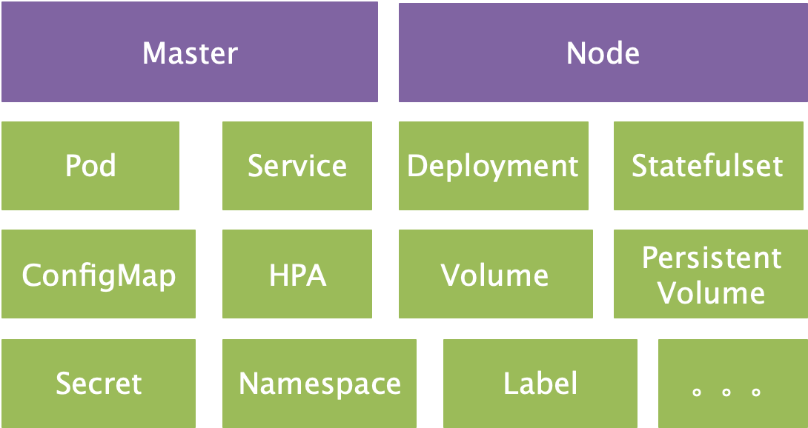
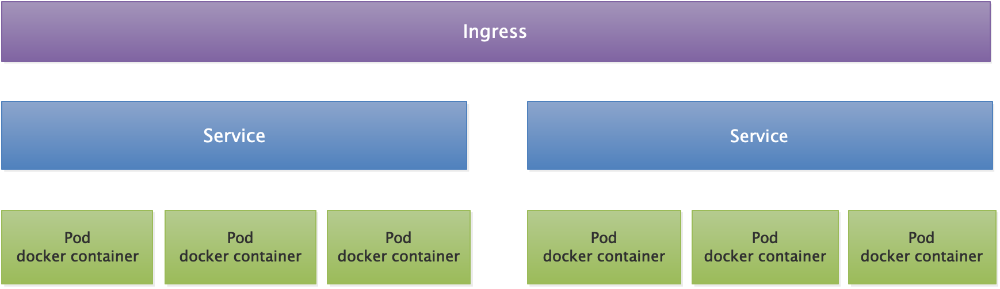
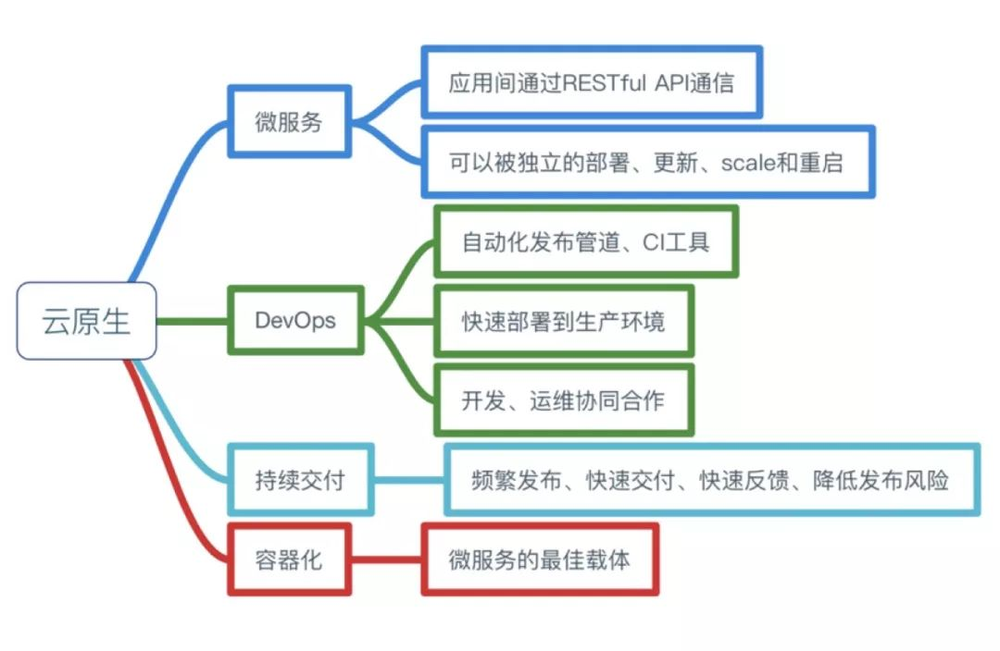
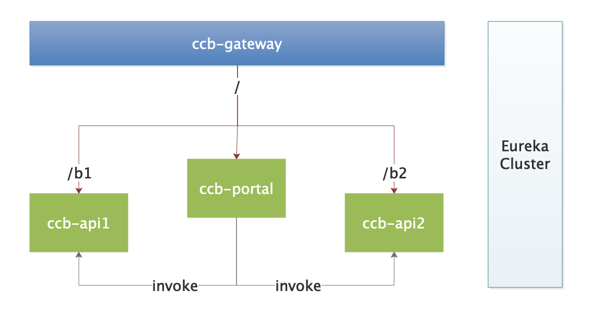
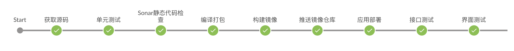
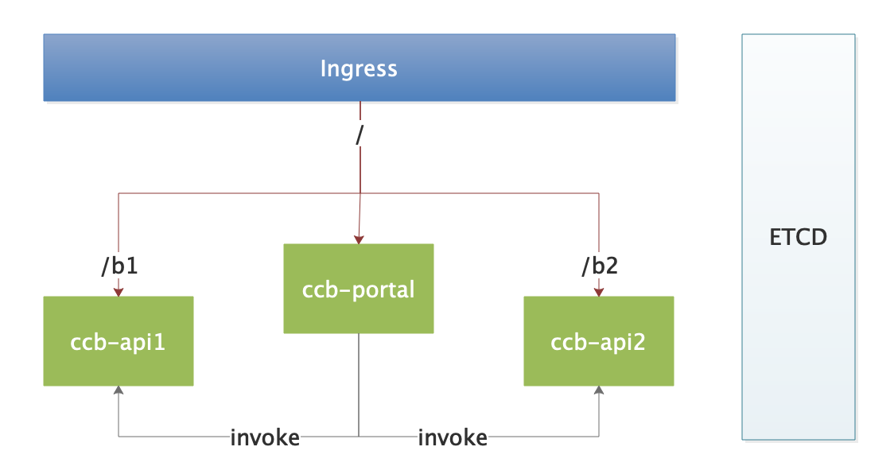

##  应用容器化分享

### 一. 分享内容

- **什么是容器化**
- **云原生**
- **SpringCloud 和 Kubernetes**
- **Demo演示**


### 二. 什么是容器化

1. 将应用程序、依赖项及其配置，抽象化成一份部署清单文件，通过这份部署清单，打包成一个容器的镜像。
2. 对镜像运行后的容器，能够方便的编排、调度和管理。

- **Docker**

  Docker 是最知名的容器运行时技术，是对 Linux 容器（LXC）的一种封装，通过 CGroup 实现进程的隔离。开发人员编写 Dockerfile，通过Dockerfile 构建出 Docker Image，最后通过 Docker Image 运行出一个容器。

  - Base Java Image 

    ```dockerfile
    FROM centos:7.5.1804
    
    LABEL maintainer="sunchao.zh <sunchao.bj@ccbft.com>"
    
    ENV JAVA_HOME /usr/local/java
    ENV PATH $JAVA_HOME/bin:$PATH
    ENV TZ=Asia/Shanghai LC_CTYPE=en_US.UTF-8
    
    ADD jre-8u221-linux-x64.tar.gz /usr/local
    
    RUN ln -snf /usr/share/zoneinfo/$TZ /etc/localtime && echo $TZ > /etc/timezone \
      && ln -sf /usr/local/jre1.8.0_221 /usr/local/java
    
    ENTRYPOINT [ "java", "-version" ]
    ```

    构建镜像：`docker build -t my-java:jre8 .`

    测试:  `docker run --rm  my-java:jre8`

  - Java App Image

    ```dockerfile
    FROM my-java:jre8
    
    LABEL maintainer="sunchao.zh <sunchao.bj@ccbft.com>"
    
    ENV JAVA_OPTS="-Xms512m -Xmx1024m -XX:MetaspaceSize=64m -XX:MaxMetaspaceSize=128m" 
    
    WORKDIR /workspace
    
    ADD getting-started-1.0.jar ./app.jar
    
    EXPOSE 8080
    
    VOLUME [ "/workspace/tomcat/logs" ]
    
    ENTRYPOINT [ "sh", "-c", "java $JAVA_OPTS -jar /workspace/app.jar" ]
    ```

    构建镜像：`docker build -t my-app:v1 .`

    测试: `docker run -d --name app -p 8080:8080 my-app:v1`、访问 localhost:8080

​		参考资料： 

​	 【Docker介绍】http://www.ruanyifeng.com/blog/2018/02/docker-tutorial.html

​     【Docker命令】https://www.simapple.com/docker-commandline

​     【Dockerfile】http://www.dockerinfo.net/dockerfile介绍

- **Kubernetes**

  kubenetes 是一个开源的自动化的容器集群管理系统，可以实现容器集群的自动化部署、弹性伸缩、自动扩缩容、调度等功能。简称 k8s。

  - 主要对象

    

  

  - 通信方式

  

servicename.<ns>.svc.cluster.local

参考资料：

- http://docs.kubernetes.org.cn
- https://kubernetes.io/docs/concepts

编排：

- helm
- kustomize

### 三. 云原生



#### 1. 微服务

应用的内聚更强、更加敏捷，让应用更好、更快的交付给客户。那问题在于：

1. 什么样的应用需要微服务？
2. 微服务需要如何进行切割？
3. 如何自动化部署？ 

#### 2. 持续交付

软件开发人员如何将一个好点子，以最快的速度交付给用户的方法。整个过程包括：持续集成 + 持续交付 + 持续部署，即一整套 ”发布流水线“。

**持续集成**：**从编码到构建再到测试的反复持续过程**。“持续集成”一旦完成，则代表产品处在一个可交付状态，但并不代表这是最优状态，还需要根据外部使用者的反馈逐步优化。（构建的自动化）

**持续交付：** **持续集成**后，获取外部对软件的反馈，在通过**持续集成**进行优化的过程。（反馈的自动化）

**持续部署：**将可交付的产品，快速且安全的交付用户使用的一套方法和系统。（部署的自动化）

#### 3. 容器化

- 统一了应用交付的标准。
- 规定了部署环境的一致性。
- 确保了运行时的隔离性。
- 实现了强大的可移植性。

#### 4. DevOps

- DevOps是一个敏捷思維，是一个沟通的文化，当运维和研发有良好的沟通效率，才可以有更大的生产力。
- 采用各种工具，搭建自动化的发布流水线。（jenkins、gerrit、sonar、docker、k8s等）

### 四. SpringCloud 和 Kubernetes

| 微服务技术栈 | Spring Cloud                      | Kubernetes                      |
| ------------ | --------------------------------- | ------------------------------- |
| 服务发现     | eureka、consul、zookeeper、Nacos  | etcd                            |
| 配置中心     | spring cloud config（携程Apollo） | configmap                       |
| 网关         | zuul、spring cloud gateway        | ingress                         |
| 负载均衡     | ribbon                            | service                         |
| 容错机制     | hystrix、Resilience4j、Sentienl   |                                 |
| 扩缩容       |                                   | 手动扩缩容、hpa                 |
| 服务链路跟踪 | zipkin、jaeger（第三方）          | zipkin、jaeger（第三方）        |
| 服务调度     |                                   | k8s scheduler                   |
| 资源管理     |                                   | k8s 本身就是一个资源管理平台    |
| 进程隔离     |                                   | docker                          |
| 日志中心     | ELK（第三方）                     | ELK、EFK（第三方）              |
| 监控中心     | Spring boot Admin                 | Prometheus、Grafana（第三方）   |
| 故障恢复     |                                   | liveness、readiness、deployment |

### 五. Demo

- Github：https://github.com/dante7qx/container-share.git

- SpringCloud 部署在 k8s

  - 应用架构

  

  - 部署流程

  

- NoSpringCloud 部署在 k8s

  - 应用架构

  

  - 部署流程

  

### 六. 联系方式


